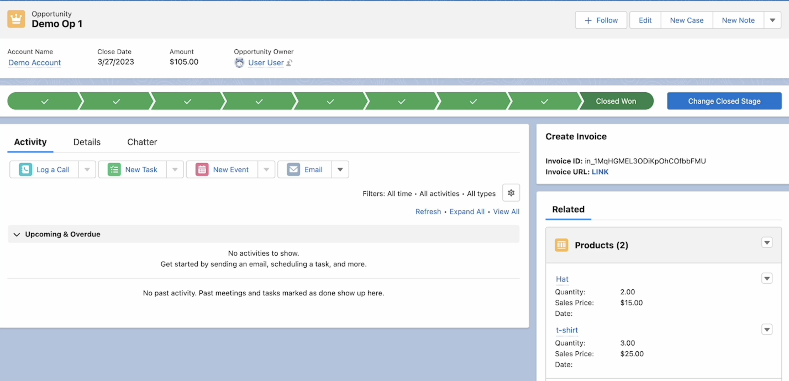
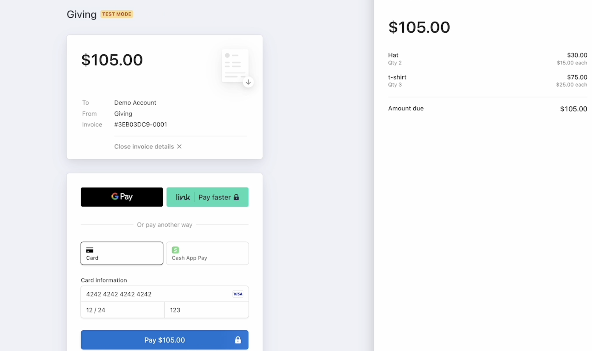

# Set up Opportunity Stripe Invoice

This sample shows how to create a Stripe Invoice from an opportunity in Salesforce.
[Overview Video to Create](https://drive.google.com/file/d/1PTeeIkWmxrhmB2-bu27PJIU27HTuYA-Z/view?usp=share_link)

Add a Generate Invoice Link


Return Invoice Details


Stripe Invoice 

## Run the sample locally

_This example can be installed locally
configuration will vary depending on your salesforce environment._

### Requirements

- **A Stripe account**: You can sign up for a Stripe account here: https://dashboard.stripe.com/register
- **A Salesforce Org**: You can register for a Salesforce account here: https://developer.salesforce.com
- **Stripe Universal Connector v1.7+ [Installed and Configured](https://docs.google.com/document/d/1CY_rppxQaN-k9mTfm-Tqy8wnWGfXDWVEFNCBri_SjuQ/edit?usp=share_link)**: Register for the connecrtor here: https://stripe.com/docs/plugins/stripe-connector-for-salesforce/overview

### Installing the example

To download a Salesforce project from GitHub and deploy it into a Dev or Scratch org, follow these steps:

1. Clone the GitHub repository that contains the Salesforce project you want to download onto your local machine using the git clone command. ```sh
git clone https://github.com/stripe/salesforce-connector-examples.git
```

2. Once the repository is cloned, navigate to the root directory of the example in the command line interface.
```sh
mkdir salesforce-connector-examples
cd salesforce-connector-examples
```

3. Create a new Salesforce project in your Dev or Scratch org using the Salesforce CLI command sfdx force:project:create. 
For example:
```sh
sfdx force:project:create --projectname <project-name>
```
4. Use the Salesforce CLI command sfdx force:source:retrieve to retrieve the metadata for the Salesforce project from the GitHub repository into your local machine. For example:
```sh
sfdx force:source:retrieve --manifest pattoGithubdownload/salesforce-connector-examples/Opportunity-Stripe-Invoice/package.json
```
5. Once the metadata is retrieved, deploy it to your Dev or Scratch org using the Salesforce CLI command sfdx force:source:push. 
For example:
```sh
sfdx force:source:push
```
6. Verify that the Salesforce project is deployed correctly by checking the Dev or Scratch org.
Note: Before deploying the Salesforce project to your Dev or Scratch org, make sure that you have the required permissions and dependencies installed. You may also need to modify the package.xml file to retrieve only the necessary metadata components.


## Get support
If you found a bug or want to suggest a new [feature/use case/sample], please [file an issue](../../issues).

If you have questions, comments, or need help with code, we're here to help:
- by [email](mailto:sfuniversalconnector@stripe.com)

Sign up to [stay updated with the connecor](https://stripe.com/docs/plugins/stripe-connector-for-salesforce/overview).

## Author(s)

- [@millin-stripe](https://github.com/millin-stripe)


## Contributors

<a href="https://github.com/stripe-samples/subscription-use-cases/graphs/contributors">
  
</a>

Made with [contrib.rocks](https://contrib.rocks).
